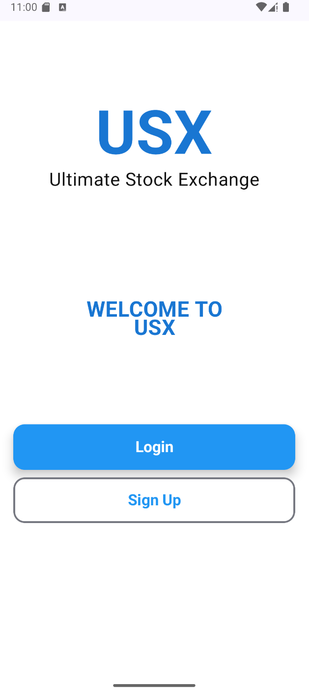
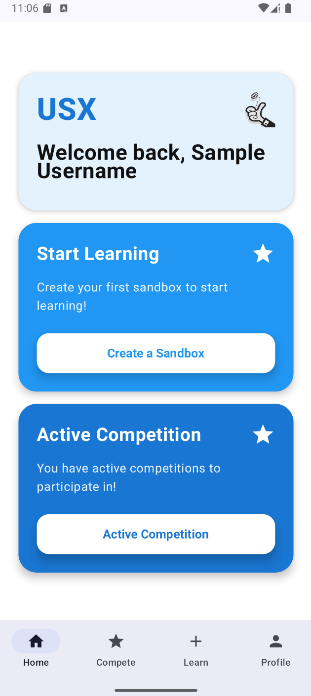
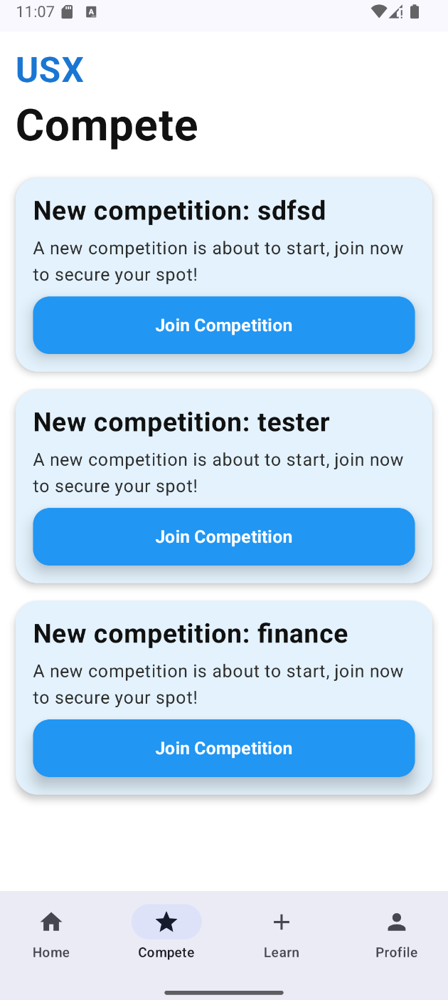
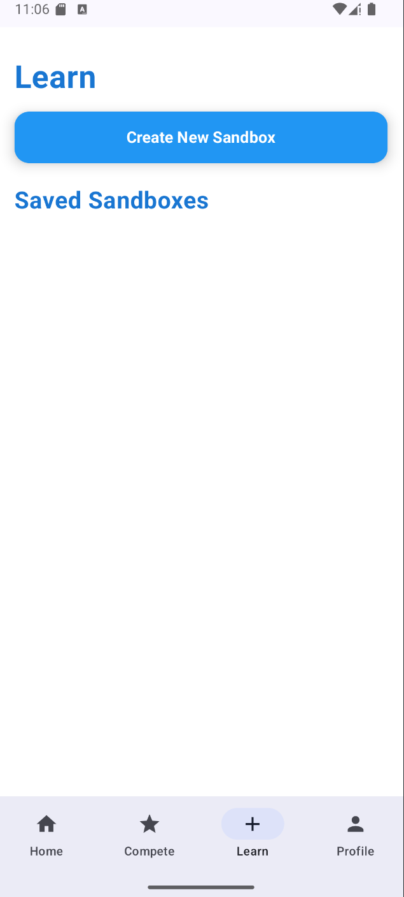
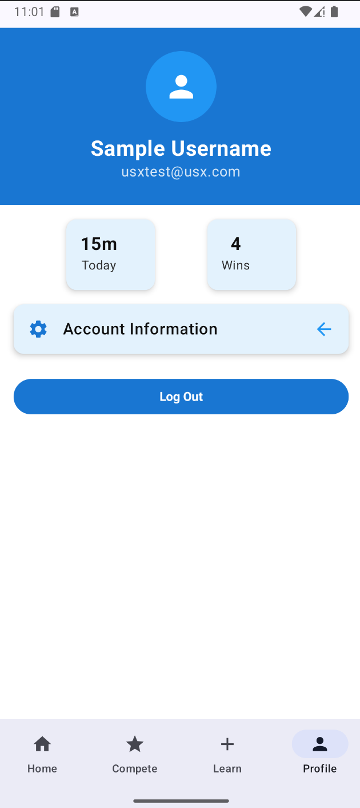
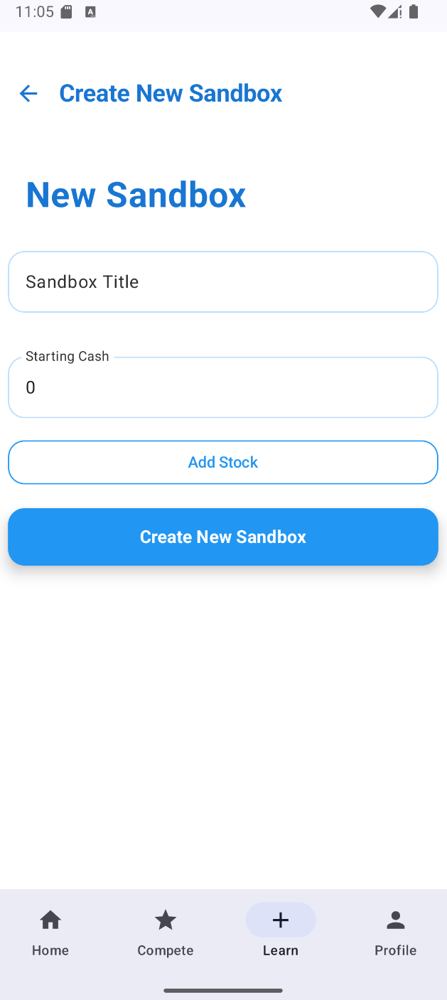

# Stock Trading Simulator

An Android mobile stock-trading simulation app where users can practice portfolio management in sandbox mode or compete in multiplayer trading challenges. The app is designed as a financial-literacy product: users can learn trading concepts through simulated decisions without putting real money at risk.

## Product Overview

Users can trade stocks in two primary modes:

- **Sandbox Mode**: a single-player mode where users set starting cash, select stock categories, build a portfolio, and use AI-generated news events to see how market scenarios affect decisions.
- **Competition Mode**: a multiplayer mode where users compete for the highest portfolio value within a time limit while news events influence stock prices.

## What This Demonstrates

- Android application development with Kotlin and Gradle.
- Mobile onboarding, profile, learning, sandbox, and competition flows.
- Portfolio and stock-trading state modeling.
- Product thinking around simulated investing, competition, and user education.
- Team-based software delivery with release planning and documentation.

## Tech Stack

Android, Kotlin, Gradle, Firebase-related configuration, Android Studio project structure.

## Screenshots

## Team

Team 101-6:

- Bassam Ahmed
- Rocky J. Luo
- Alex Gan
- Ishaan Puri
- Soumik Debnath

## Run Locally

Open this folder in Android Studio and sync the Gradle project. Use an Android emulator or physical device to build and run the app.

## Notes

This project came from a team-based software engineering workflow. The repository preserves project documentation links, release history, screenshots, and source structure for portfolio review.
